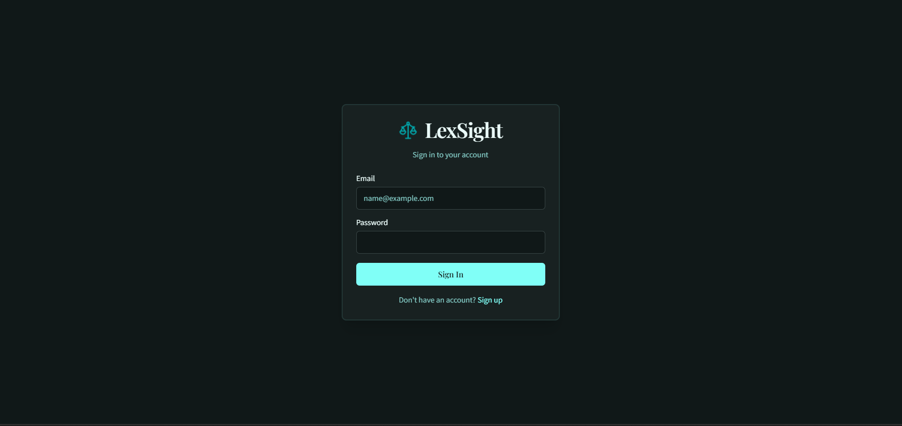
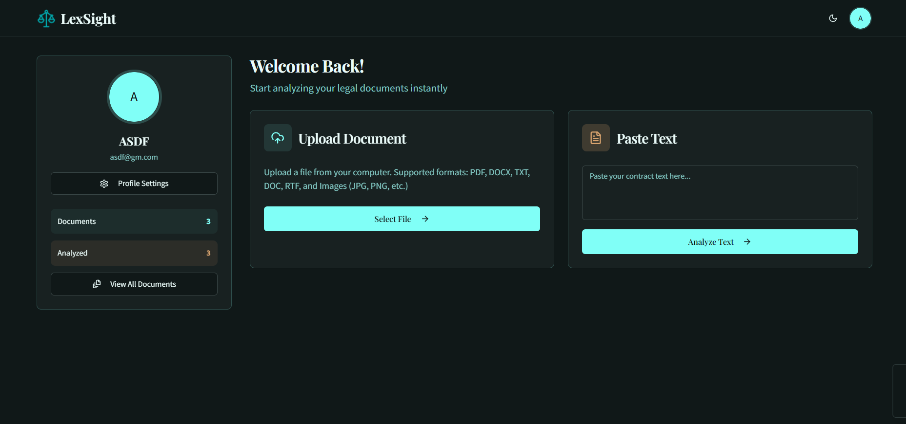

# 🏛️ LexSight AI  

<div align="center">


## **LexSight AI**
### **Your AI-Powered Legal Co-Pilot**

*Simplify contracts, agreements, and compliance with AI.*  
Understand your rights, flag risks, and manage legal documents in your native language — **fast, affordable, and accessible**.

[](https://nextjs.org/)
[](https://www.typescriptlang.org/)
[](https://supabase.com/)
[](https://ai.google.dev/)

</div>

---

## 🎯 About

**LexSight AI** is an intelligent legal document assistant designed to democratize legal understanding.  
It bridges the gap between **complex legal jargon** and **everyday users**, helping individuals, startups, MSMEs, and students confidently understand contracts and compliance requirements.

### Why LexSight?
- 📄 Legal documents are difficult to understand  
- 💰 Legal consultation is expensive  
- ⏰ Compliance tracking is time-consuming  
- ⚖️ Users often don’t know their rights  

**LexSight AI solves this** by providing AI-powered document analysis, summaries, and risk detection in one unified platform.

---
## 📸 UI Screenshots

<p align="center">
  
</p>

<p align="center">
  
  
</p>

---

## ✨ Key Features

### 🔍 Core Functionality

1. **📤 Document Text Extraction**
   - Upload PDFs, DOCX files, and scanned images
   - OCR-powered text extraction using Tesseract
   - Clean, readable text output

2. **🧠 Clause Segmentation**
   - Automatically breaks contracts into clauses
   - Uses Regex + AI for higher accuracy
   - Well-structured and readable output

3. **🌐 Contract Summarization**
   - Plain-language explanations of legal clauses
   - Multilingual support (English, Hindi & more)
   - Highlights obligations, rights, and risks

4. **⚠️ Risk Analysis**
   - Flags risky or unfair clauses
   - Detects missing protections
   - Assigns risk scores with reasoning

### 🎨 User Experience
- Modern, responsive UI
- Dark mode support
- Smooth animations with Framer Motion
- Mobile-friendly and accessible components

### 🔐 Security
- Secure session-based authentication
- Password hashing with bcrypt
- Middleware-protected routes
- Controlled access to user documents

---

## 🛠️ Tech Stack

### Frontend
- **Next.js 15.3.3** (App Router + Turbopack)
- **TypeScript**
- **Tailwind CSS**
- **Radix UI**
- **Framer Motion**
- **Lucide Icons**

### Backend & Database
- **Next.js API Routes**
- **Supabase (PostgreSQL)**

### AI & Document Processing
- **Google Gemini AI**
- **Google Genkit**
- **Groq API (high-performance LLM inference)**
- **Tesseract.js** (OCR)
- **pdf-parse**
- **office-text-extractor**
---

## 🚀 Getting Started

### Prerequisites
- Node.js **20+**
- Yarn package manager
- Supabase account
- Google Gemini API key

### 📦 Installation

```bash
# Clone the repository
git clone https://github.com/your-username/LexSight_AI.git

# Navigate to the project
cd LexSight_AI

# Install dependencies
yarn install
```

⚙️ Environment Variables

Create a .env.local file in the root directory:
```bash
NEXT_PUBLIC_SUPABASE_URL=your_supabase_url
NEXT_PUBLIC_SUPABASE_ANON_KEY=your_supabase_anon_key
API_KEY=your_api_key
```
▶️ Run the Project
```bash
yarn dev
```
Visit http://localhost:3000
in your browser.


### 📁 Project Structure

```bash
LexSight_AI/
├── public/                     # Static assets
│   └── logo.png
├── src/
│   ├── ai/                     # AI & Genkit configuration
│   │   ├── flows/              # AI workflows
│   │   │   ├── analyze-risk.ts
│   │   │   └── summarize-clause.ts
│   │   ├── genkit.ts
│   │   └── dev.ts
│   ├── app/                    # Next.js App Router
│   │   ├── (auth)/             # Authentication pages
│   │   │   ├── login/
│   │   │   ├── signup/
│   │   │   └── profile/
│   │   ├── api/                # API routes
│   │   │   ├── auth/
│   │   │   └── extract-text/
│   │   ├── dashboard/          # User dashboard
│   │   ├── home/               # Home page
│   │   ├── layout.tsx          # Root layout
│   │   └── page.tsx            # Landing page
│   ├── components/             # Reusable UI components
│   │   ├── ui/                 # Radix UI primitives
│   │   ├── dark-veil.tsx
│   │   └── icons.tsx
│   ├── hooks/                  # Custom React hooks
│   ├── lib/                    # Utilities & helpers
│   │   ├── db.ts               # Database client
│   │   ├── auth.ts             # Auth utilities
│   │   ├── actions.ts          # Server actions
│   │   └── utils.ts
│   └── services/               # Business logic
│       └── documents.ts
├── middleware.ts               # Route protection middleware
├── supabase-schema.sql         # Database schema
├── tailwind.config.ts          # Tai
```  
## 👨‍💻 Developer

**Pratham P. Sharma**  
Creator & Developer of **LexSight AI**

### 🤝 Contributions

Contributions are welcome and appreciated!

- Fork the repository  
- Create a new feature branch  
- Commit your changes  
- Open a Pull Request  

Feel free to submit issues, feature requests, or improvements to help make LexSight AI better.

